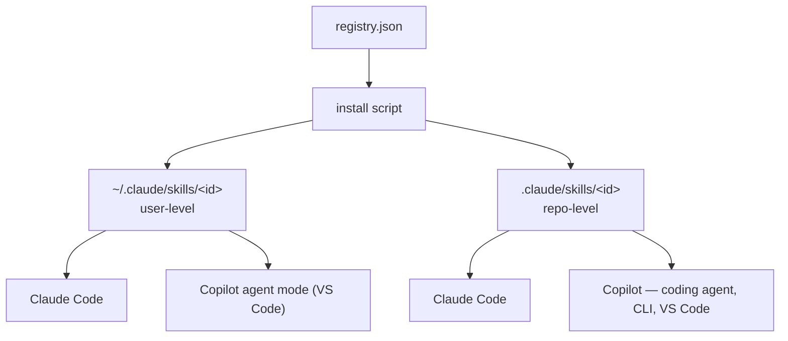

# ai-framework

Personal AI tooling — skills, agents, instructions, whatever shape a given piece takes — packaged so you can pull it into any machine or repo with one command, on whatever AI coding tool you use.

## Install

```powershell
irm https://raw.githubusercontent.com/nahueltaibo/ai-framework/main/installer/install.ps1 | iex
```

```bash
curl -fsSL https://raw.githubusercontent.com/nahueltaibo/ai-framework/main/installer/install.sh | bash
```

Either command downloads the installer and runs it — no clone, no dependencies beyond PowerShell or `curl`+bash. It shows you a table of what's available, where each one is already installed (and at what version), and lets you pick what to install, update, or remove.

```
#  Name                User            Repo
1  markdown-authoring  v1.0.0          not installed
```

Run it again any time — it diffs against what's already in place and only touches what changed.

## What's inside

| Name | Type | Description | Version |
|---|---|---|---|
| `markdown-authoring` | skill | Tone, structure, and formatting rules for writing `.md` files | 1.0.0 |

Each entry lives in its own folder under the matching type (`skills/<id>/`, and more as they show up — `agents/`, `instructions/`), written once in its natural format. `registry.json` is the catalog the installer reads — it's the source of truth for what version each one is on.

## Where things go

Claude Code and GitHub Copilot both read the same open Agent Skills format — a `SKILL.md` file with `name` and `description` frontmatter — out of the same well-known folders. No conversion, no per-tool copy: one file works for both.



- **User-level** (`~/.claude/skills/<id>/SKILL.md`): Claude Code, and Copilot's agent mode in VS Code, both check this folder directly.
- **Repo-level** (`<repo>/.claude/skills/<id>/SKILL.md`): Claude Code and every Copilot surface — coding agent, CLI, VS Code — check `.claude/skills/` in the repo, same as `.github/skills/` and `.agents/skills/`.

GitHub Copilot CLI's own personal folder is `~/.copilot/skills/` rather than `~/.claude/skills/` — copy the same file there too if you use the CLI and want it picked up without a repo checkout.

Each install location keeps a small `.ai-framework-installed.json` file recording what's there and at what version — that's what powers the status column in the table. The repo-level one gets committed, so anyone cloning a repo you've set this up in sees the same state.

## Manual install

No script needed — copy `skills/<id>/SKILL.md` to `~/.claude/skills/<id>/SKILL.md` (user-level) or `<repo>/.claude/skills/<id>/SKILL.md` (repo-level). That's it — the same file is read by both Claude Code and Copilot.

## Adding a tool

Drop a new folder under the matching type with its native file inside, then add an entry to `registry.json` with its `id`, `type`, `description`, and `version`. Bump `version` whenever you change something's content — that's what tells the installer an update is available.
